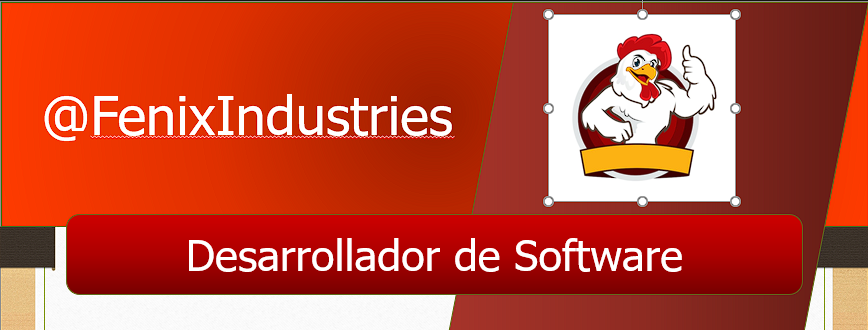

<h1 aling="center">Hola</h1>  

Soy Roberto Alanís Hernández Arredondo  
A continuación le dejo mis redes sociales:   
https://www.facebook.com/profile.php?id=100045966193656  
https://web.whatsapp.com My telefono es: 899 542 9870  
https://x.com/fenixhd010m  
https://www.instagram.com/fenixhd010/   
A continuación 2 Videos de los cuales he contado el gusto de participar   
https://youtu.be/CxF3ykWP1H4?si=P8IzJSMRjlk8_Iff
https://youtu.be/3GymExBkKjE?si=4oxJGJaEBkqIjFeR
  
A continuación un resumen de mi experiencia en la programación
 

Soy alumno del Bachillerato Militarizado Reynosa, estudainte del taller de programación, cuento con conocimiento avanzado en el manejo y control de HTML, Java Script Vs code y C++  asimismo conozco y utilizo eficientemente el Git Hub, dandome una facilidad para trabajar de manera conjunta con un equipo de desarrollo.

<!---
FenixHD10/FenixHD10 is a ✨ special ✨ repository because its `README.md` (this file) appears on your GitHub profile.
You can click the Preview link to take a look at your changes.
--->
